# Deen Daily (v1.0.0)

Your daily guide to Deen — a modern Expo app that brings prayer times, Quran, hadith, fasting, and zakat tools into one clean, consistent experience.

## Highlights

- Prayer times with location support, next-prayer countdown, and qibla direction.
- Quran browsing with surah details and translations.
- Hadith browsing, search, and chapters.
- Fasting cards (sahur/iftar) and white days.
- Zakat nisab info and calculator.
- Asma-ul Husna (name of the day + full list).
- Consistent theming with shared palette, typography, and card styles.

## Screenshots (v1.0.0)

<table>
	<tr>
		<td>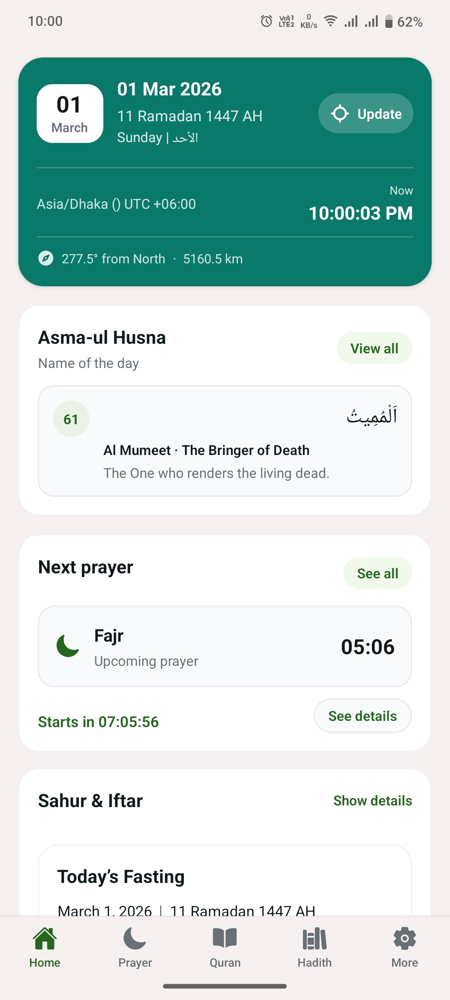</td>
		<td>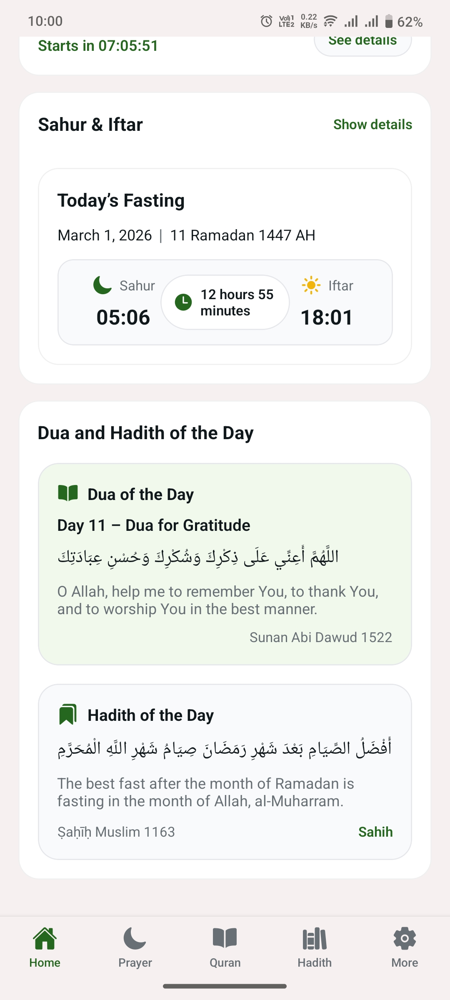</td>
	</tr>
	<tr>
		<td>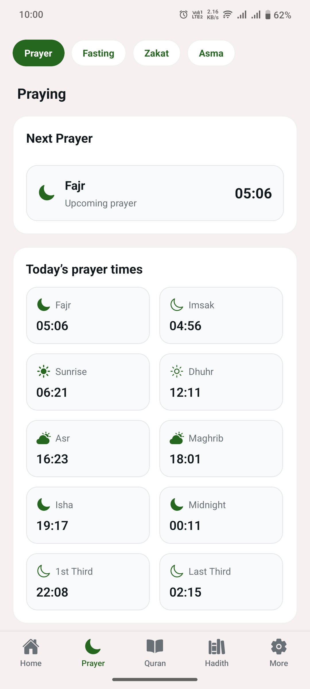</td>
		<td>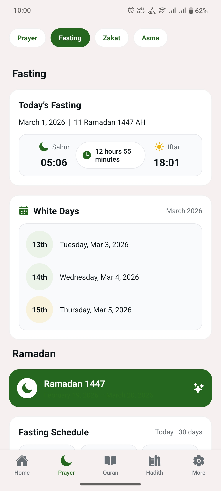</td>
	</tr>
	<tr>
		<td>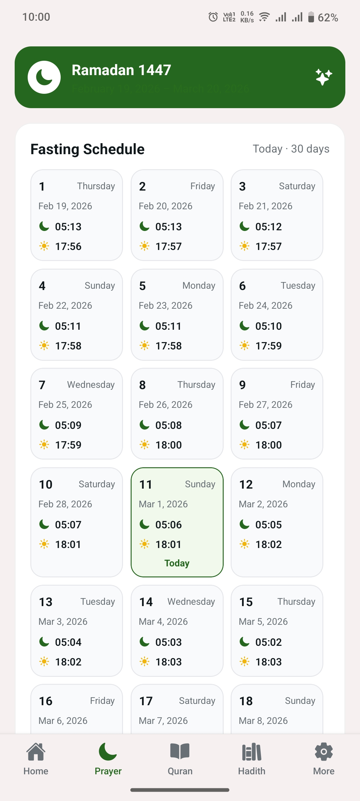</td>
		<td>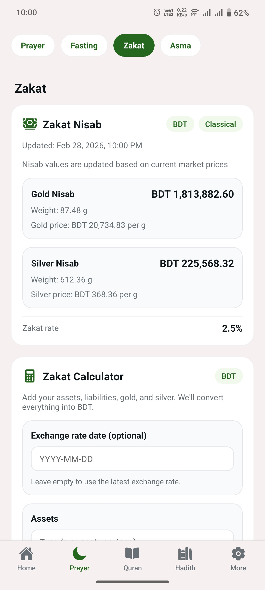</td>
	</tr>
	<tr>
		<td>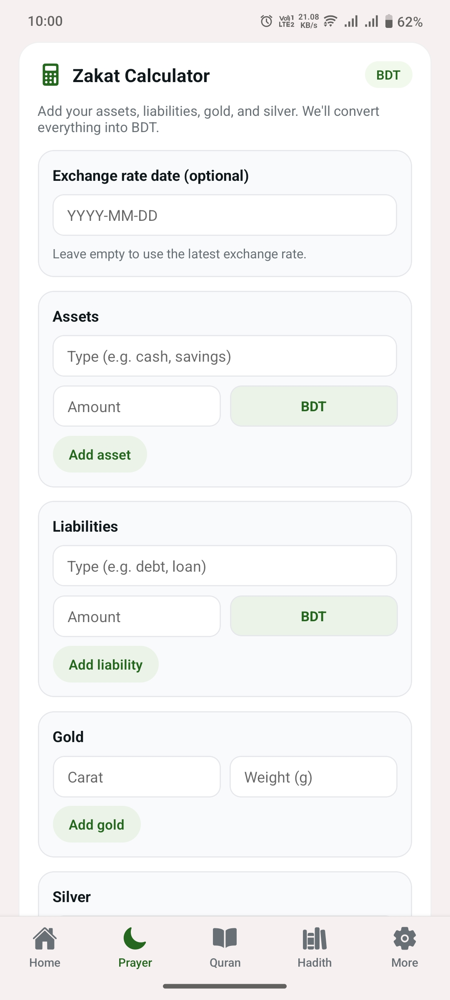</td>
		<td>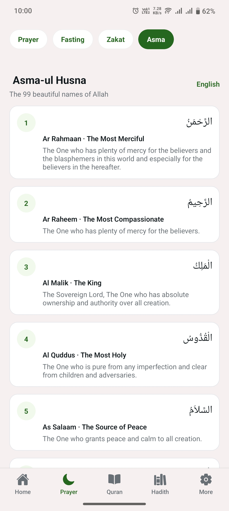</td>
	</tr>
	<tr>
		<td>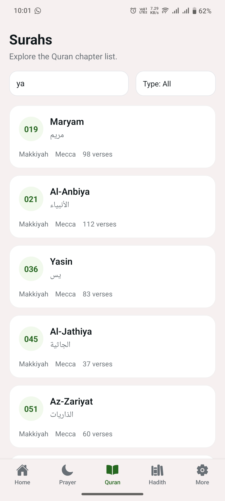</td>
		<td>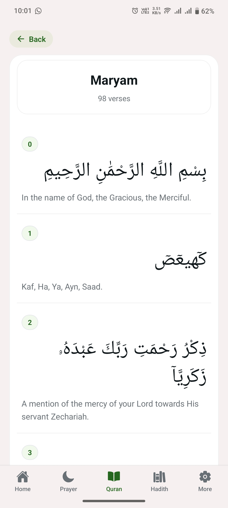</td>
	</tr>
	<tr>
		<td>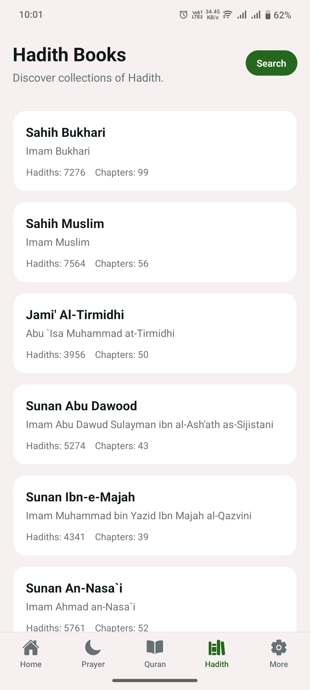</td>
		<td>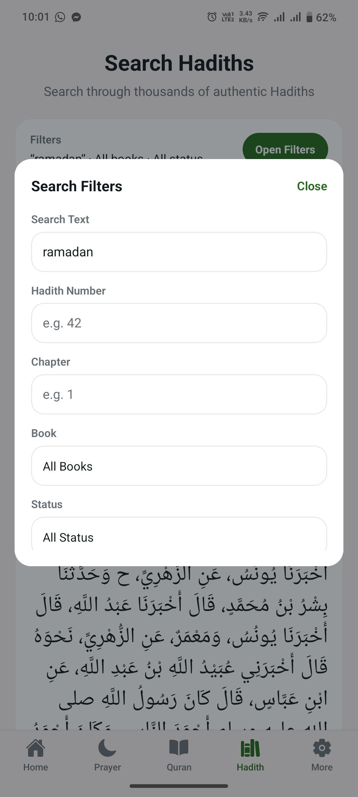</td>
	</tr>
	<tr>
		<td>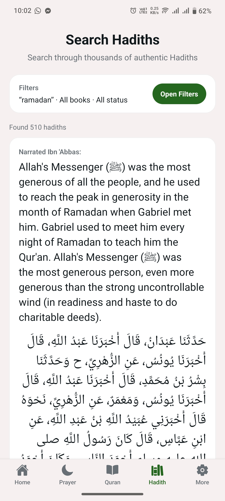</td>
		<td>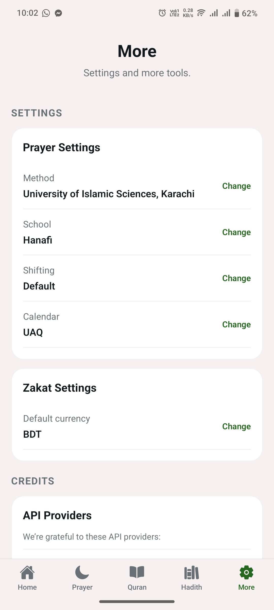</td>
	</tr>
	<tr>
		<td>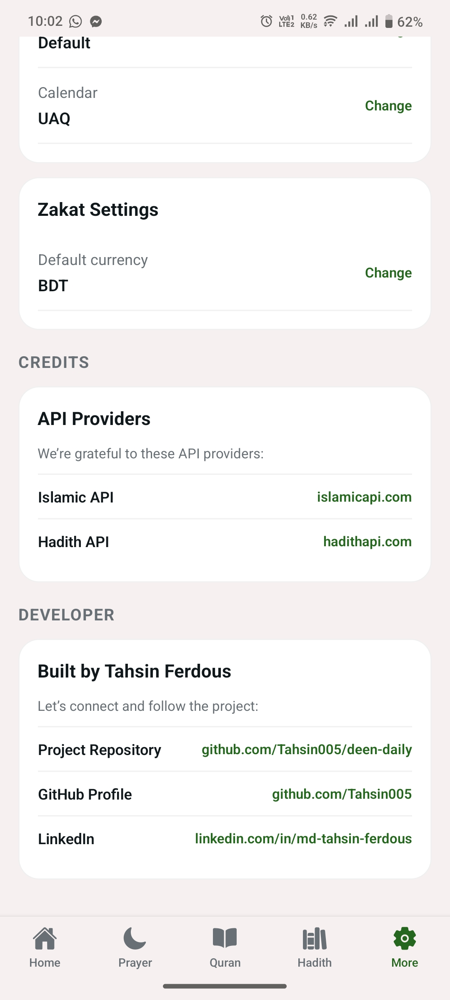</td>
	</tr>
</table>

## Tech stack

- Expo (React Native)
- Expo Router
- React Query
- TypeScript
- Bun runtime

## Getting started

1) Install dependencies:

```bash
bun install
```

2) Start the app:

```bash
bun run start
```

3) Run on Android (optional):

```bash
bun run android
```

### Android prebuild & run

If you need to regenerate native Android projects:

```bash
bunx expo prebuild --platform android
```

Run the Android app:

```bash
bunx expo run:android
```

## Environment variables

Create a `.env` file at the project root and provide API settings (values depend on your API plans):

```bash
EXPO_PUBLIC_ISLAMIC_API_BASE_URL=
EXPO_PUBLIC_HADITH_API_BASE_URL=
EXPO_PUBLIC_QURAN_API_BASE_URL=
EXPO_PUBLIC_ISLAMIC_API_KEY=
EXPO_PUBLIC_HADITH_API_KEY=
```

## Project structure

- `app/` — screens and routes (Expo Router)
- `components/` — UI components by domain
- `lib/api/` — API fetchers
- `lib/storage/` — local storage helpers
- `constants/` — theme tokens and settings

## Credits

This project uses the following APIs:

- Islamic API — https://islamicapi.com/
- Hadith API — https://hadithapi.com/

## Developer

- Project repo: https://github.com/Tahsin005/deen-daily
- GitHub: https://github.com/Tahsin005/
- LinkedIn: https://www.linkedin.com/in/md-tahsin-ferdous/